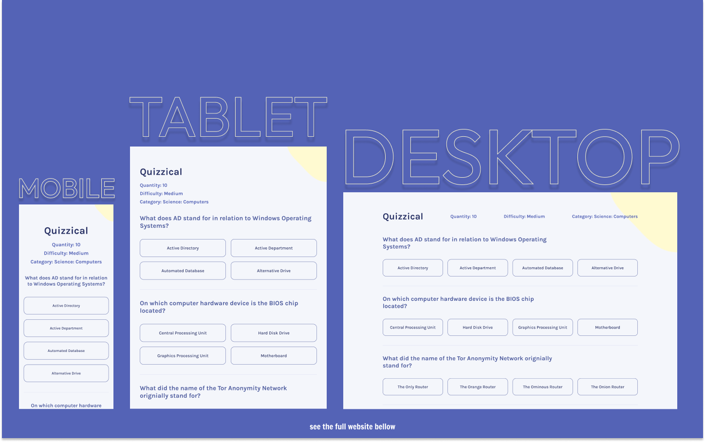

# Quizzical App

## Table of contents

- [Overview](#overview)
  - [The challenge](#the-challenge)
  - [Screenshot](#screenshot)
  - [Links](#links)
- [My process](#my-process)
  - [Built with](#built-with)
  - [What I learned](#what-i-learned)
  - [Continued development](#continued-development)
  - [Useful resources](#useful-resources)
- [Author's Links](#authors-links)

## Overview

### The challenge

Users should be able to:

- Toggle between answer options
- See right/wrong answers after clicking on `Check Answewrs` button

### Screenshot

### Links

- Live Site URL: [https://kens-visuals.github.io/quizzical-app/](https://kens-visuals.github.io/quizzical-app/)

## My process

### Built with

- React
- React Router
- [Open Trivia Database](https://opentdb.com/)
- Semantic HTML5 markup
- CSS Flexbox
- CSS Grid
- Mobile-first workflow

### What I learned

This project helped me to practice passing props to multiple elements, lifting state up and a bit of `react-router`. The initial design is from [`Scrimba`](https://github.com/scrimba), I just made it responsive. I can only imagine how much work it would take me to build this project in Vanilla JS. Though there's one thing that I'm going to change for the future projects, and that is instead of using plain CSS, I'm going to start using one of the CSS-in-JS solutions. All in all, I enjoyed working with react router, and I'm going to practice it more in bigger projects. Finally, go check out your computer science skills, but don't take it too seriously!

## Author's Links

- Medium - [@kens_visuals](https://medium.com/@kens_visuals)
- CodePen - [@kens-visuals](https://codepen.io/kens-visuals)
- Codewars - [@kens_visuals](https://www.codewars.com/users/kens_visuals)
- Frontend Mentor - [@kens-visuals](https://www.frontendmentor.io/profile/kens-visuals)
